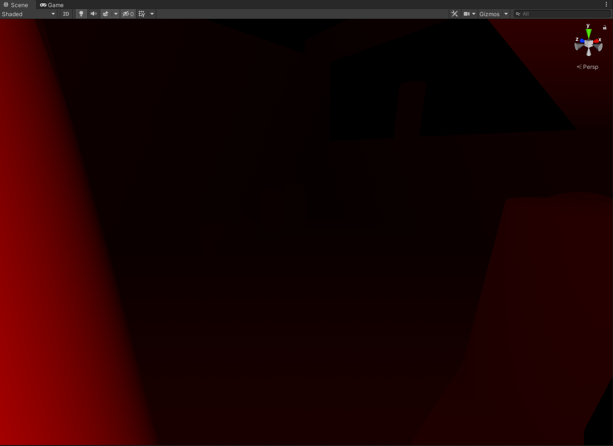
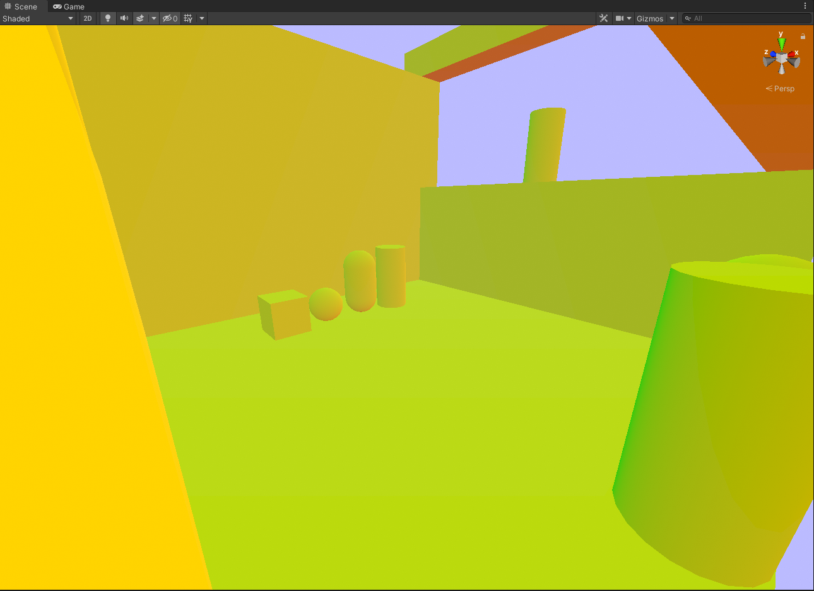
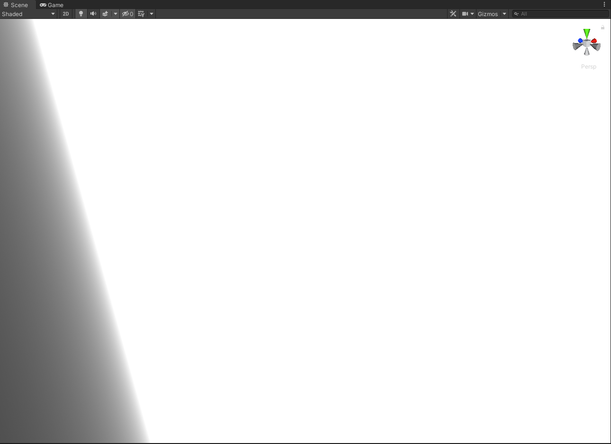
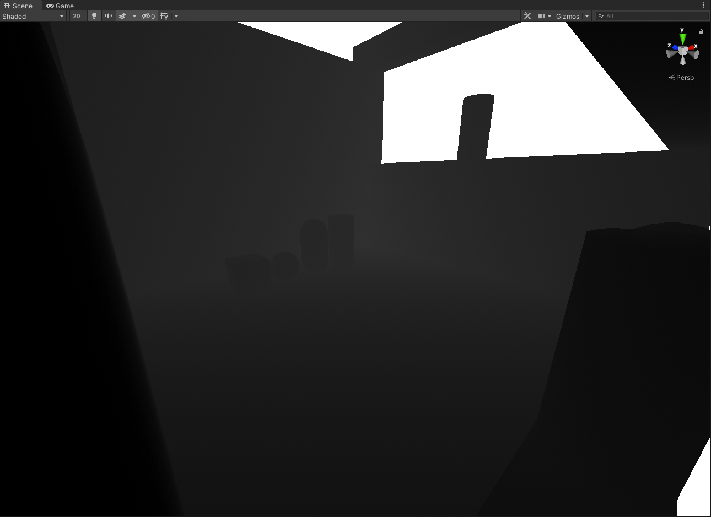
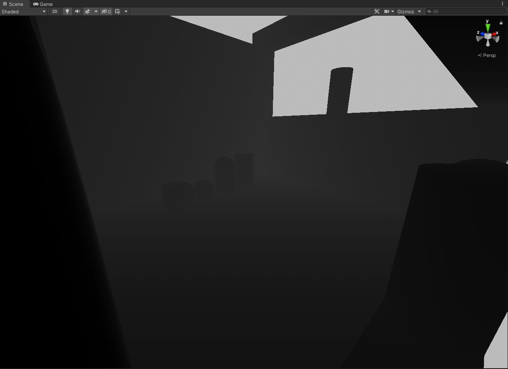
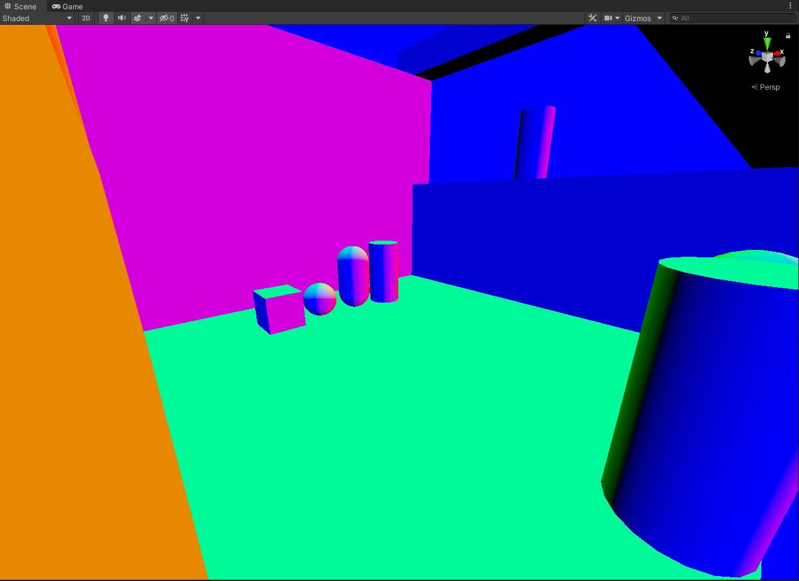
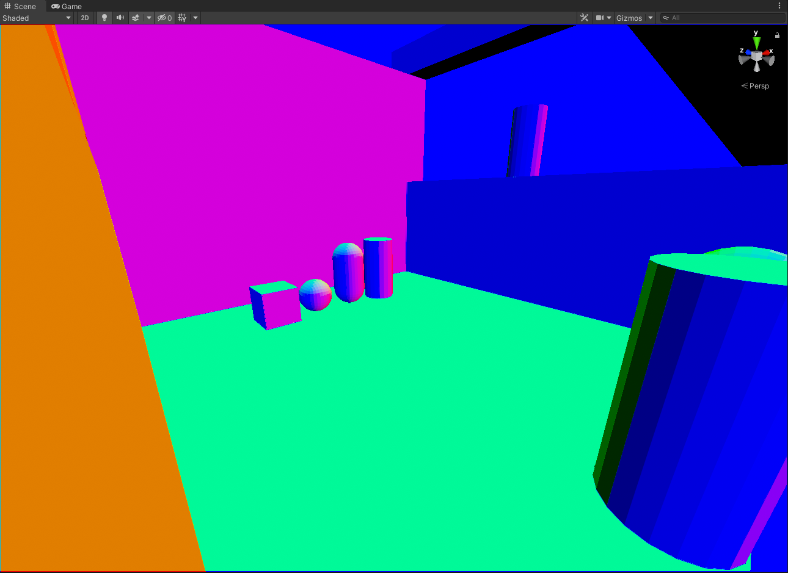
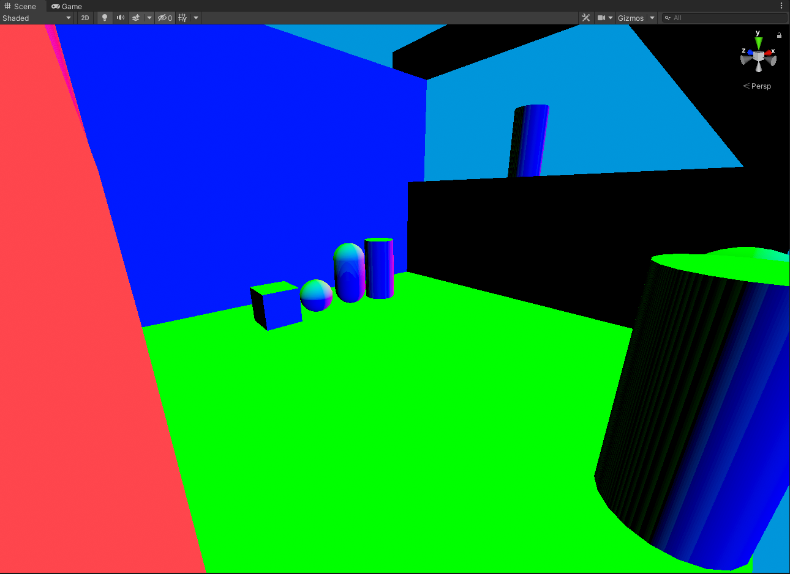
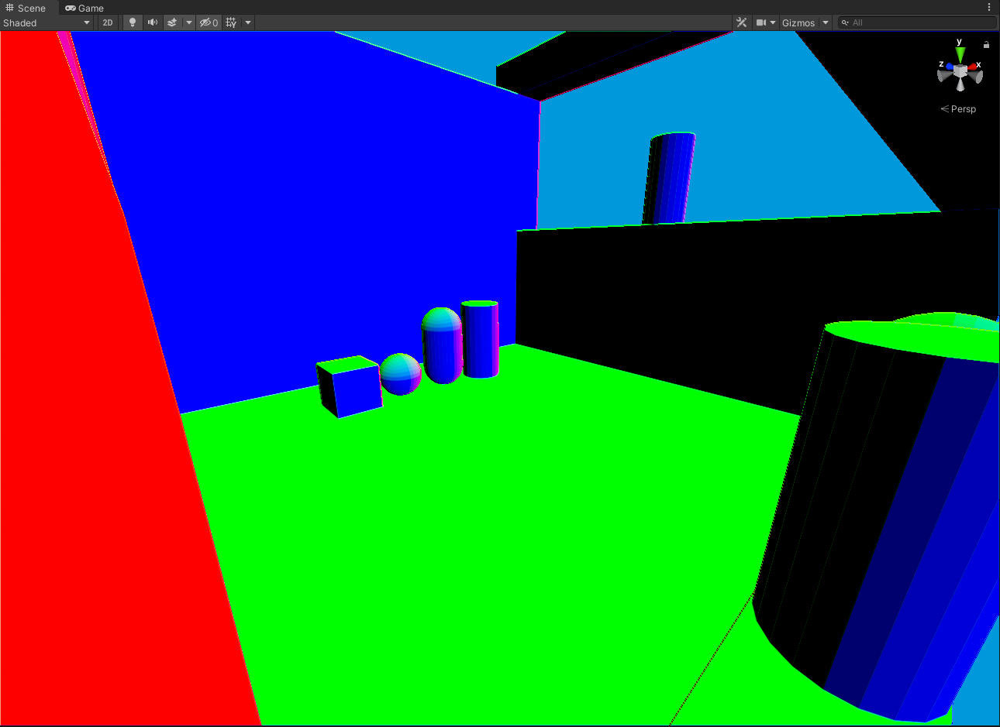
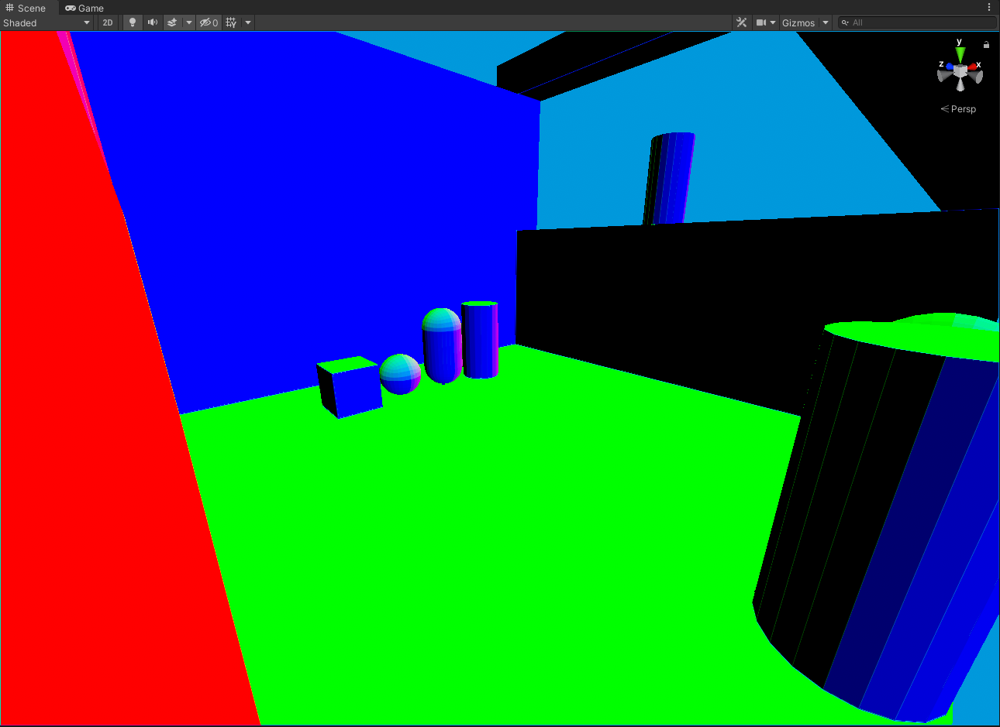

# Unity Shader Templates
A ***W.I.P*** project containing various shader templates designed for VR *(and non-vr)*.

## Object Shader

An object-based shader template that has the following...
- Configurable Cull/ZWrite/ZTest.
- Normal Maps with Adjustable Strength.
- Reflections with Box Projection Support.
- Light Probe Proxy Volume Support.
- Enlighten Realtime GI Support.
- Unity Lightmapping Support.
- Unity Fog Support.
- Custom Shadow Caster Pass.

And some additional custom things.
- Functions for Sampling Dominant Directionality from Probes/Proxy Volumes.

***More to be added...***

## Object "Post Process" Shader
An object-based shader that can be used to do post-processing without blitting to a render target *(VRChat-like case where functionality is limited)*.

This is a bit of a complex shader but it. It works with the 3 built-in camera textures.
- **Raw Camera Depth Texture:** ```_CameraDepthTexture```
- **Raw Camera Depth Normals Texture:** ```_CameraDepthNormalsTexture```
- **Raw Camera Motion Vectors:** ```_CameraMotionVectorsTexture```
- **Linear Eye Depth**
- **Linear 01 Depth**
- **View Normals**
- **World Normals**
- **View Position**
- **World Position**

## Post Processing Shader
*Based on the Unity Post Processing Stack.*

This is a single-pass effect. It works with the 3 built-in camera textures and uses them to calculate buffers you often might need: 
- **Raw Camera Depth Texture:** ```_CameraDepthTexture```
- **Raw Camera Depth Normals Texture:** ```_CameraDepthNormalsTexture```
- **Raw Camera Motion Vectors:** ```_CameraMotionVectorsTexture```
- **Linear Eye Depth**
- **Linear 01 Depth**
- **View Normals**
- **World Normals**
- **View Position**
- **World Position**

## Compute Based Post Processing Shader
*Based on the Unity Post Processing Stack.*

This is a single-pass effect, identical to the regular post-process variant. It works with the 3 built-in camera textures and uses them to calculate buffers you often might need: 
- **Raw Camera Depth Texture:** ```_CameraDepthTexture```
- **Raw Camera Depth Normals Texture:** ```_CameraDepthNormalsTexture```
- **Raw Camera Motion Vectors:** ```_CameraMotionVectorsTexture```
- **Linear Eye Depth**
- **Linear 01 Depth**
- **View Normals**
- **World Normals**
- **View Position**
- **World Position**

## Additional Notes

### Linear Eye Depth 
This is calculated by using depth from ```_CameraDepthTexture``` It can also be calculated by using depth unpacked from ```_CameraDepthNormalsTexture```.

### Linear 01 Depth
This is calculated by using depth from ```_CameraDepthTexture```. It can also be calculated by using depth unpacked from ```_CameraDepthNormalsTexture```.

### View Normals
This is calculated by unpacking view normals from ```_CameraDepthNormalsTexture```. 

It can also be calculated by generating normals from depth, although there is a caveat to that. 

Generating normals from depth will not retain any normal information from meshes, and therefore polygons that are supposed to appear "smooth" will not appear as such because we are essentially only working with position. With that said it's still a viable solution for getting a normal buffer only from a single depth texture *(either due to limitations or performance considerations)*.

Depth is sampled either from the ```_CameraDepthTexture```, or unpacked from ```_CameraDepthNormalsTexture``` *(Although this has issues at the moment for normals due to lack of precision)*. With the given depth, normals can be generated with different techniques that are implemented.
- **1 Tap Quad Intrinsics:** which calculates normals by sampling ***1 depth texture***, and using quad intrinsics to read the difference in depth values within a 2x2 pixel block to generate normals.
- **3 Taps:** which calculates normals by sampling ***3 depth textures*** to generate normals.
- **4 Taps:** which calculates normals by sampling ***4 depth textures*** to generate normals.
- **4 Taps Improved:** which calculates normals by sampling ***4 depth textures*** to generate normals.
- **14 Taps Accurate:** which calculates normals by sampling ***14 depth textures*** to generate normals.

### World Normals
Does the same as View Normals except transforms them into world space.

### View Position
Is calculated with depth from ```_CameraDepthTexture```, or depth unpacked from ```_CameraDepthNormalsTexture```.

### World Position
Is calculated with depth from ```_CameraDepthTexture```, or depth unpacked from ```_CameraDepthNormalsTexture```.

# Screenshots


#### Original Scene: 


#### Raw ```_CameraDepthTexture```


#### Raw ```_CameraDepthNormalsTexture```


#### Raw ```_CameraMotionVectorsTexture```
*(Note: Looks incorrect because this was not taken during playmode, when playmode is active the buffer will appear correctly)*


#### Linear Eye Depth *(From ```_CameraDepthTexture```)*


#### Linear Eye Depth *(From ```_CameraDepthNormalsTexture```)*
*(Note: Slightly more banding due to lower precision)*


#### Linear 01 Depth *(From ```_CameraDepthTexture```)*


#### Linear 01 Depth *(From ```_CameraDepthNormalsTexture```)*
*(Note: Slightly darker due to lower precision)*


#### View Normals *(From ```_CameraDepthNormalsTexture```)*


#### View Normals *(1 Tap Quad Intrinsics)*


#### View Normals *(3 Taps)*


#### View Normals *(4 Taps)*


#### View Normals *(4 Taps Improved)*


#### View Normals *(14 Taps Accurate)*


#### World Normals *(From ```_CameraDepthNormalsTexture```)*


#### World Normals *(1 Tap Quad Intrinsics)*


#### World Normals *(3 Taps)*


#### World Normals *(4 Taps)*


#### World Normals *(4 Taps Improved)*


#### World Normals *(14 Taps Accurate)*


#### View Position


#### World Position


## Sources

- **[Accessing builtin textures from a compute shader.](https://forum.unity.com/threads/accessing-builtin-textures-from-a-compute-shader.393528/)**
- **[bgolus](https://gist.github.com/bgolus/a07ed65602c009d5e2f753826e8078a0)**: Code implementation of different techniques for generating normals from depth.
- **[pema99](https://gist.github.com/pema99)**: [Quad Intrinsics](https://gist.github.com/pema99/9585ca31e31ea8b5bd630171d76b6f3a) library which allows room for additional optimizations/tricks.
