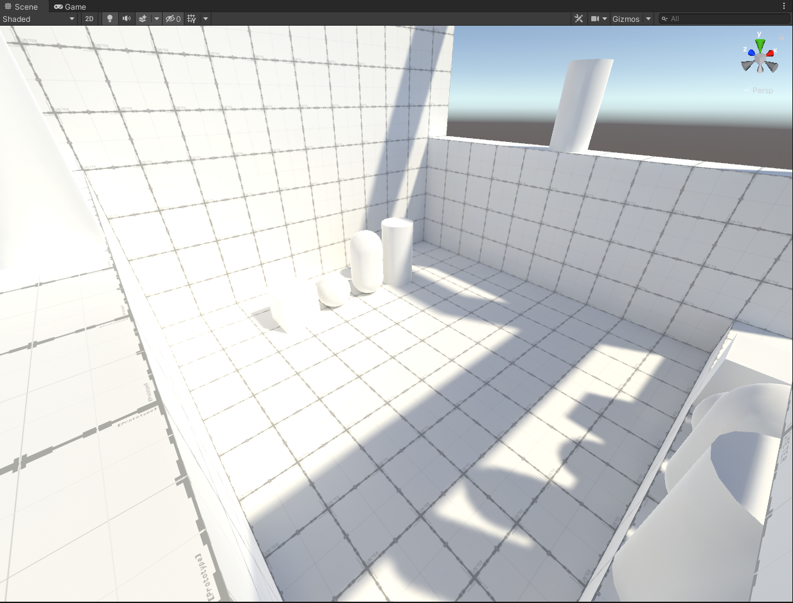
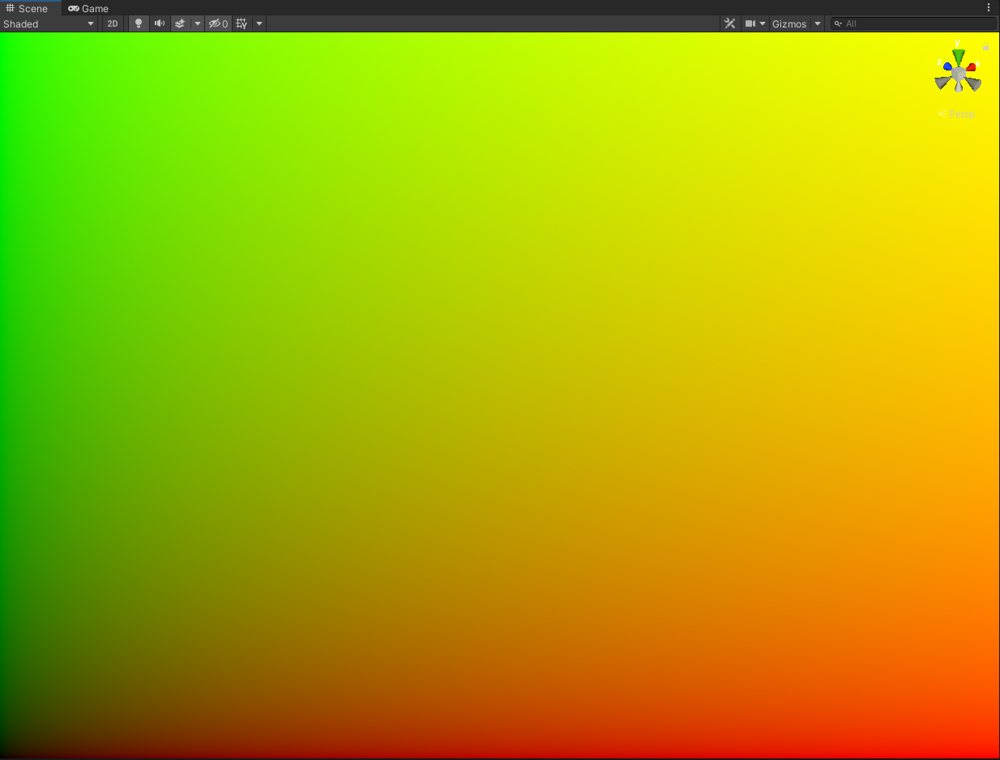
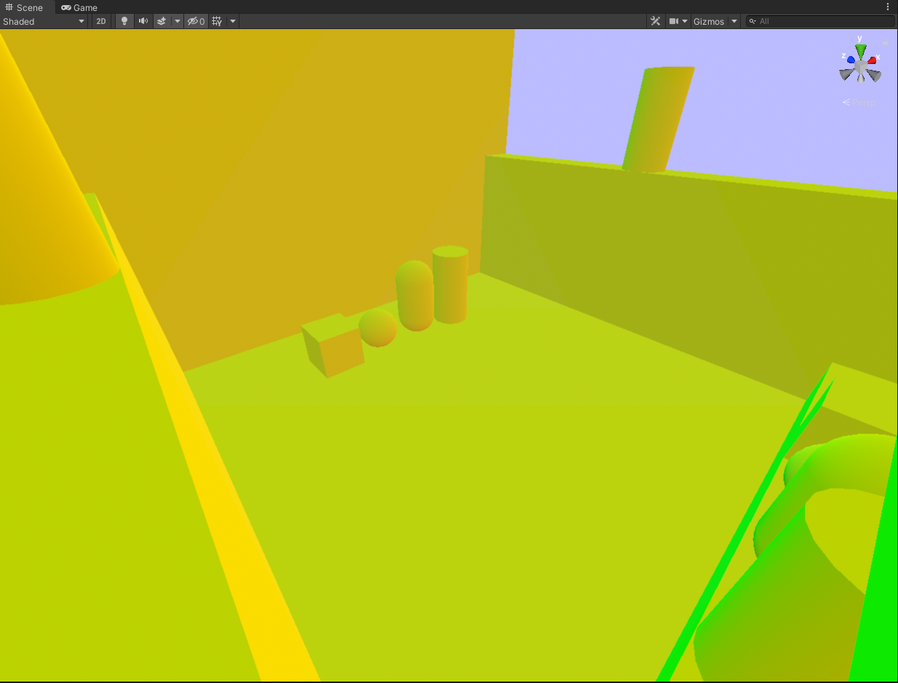
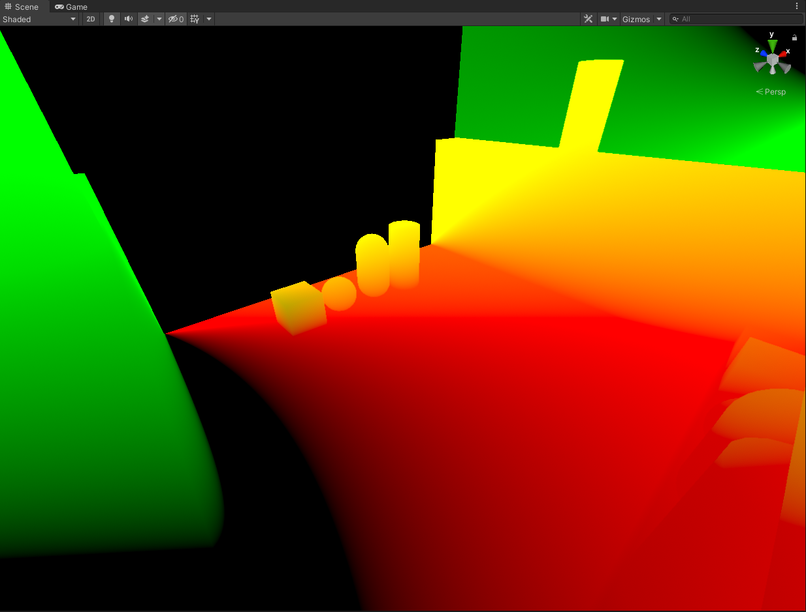
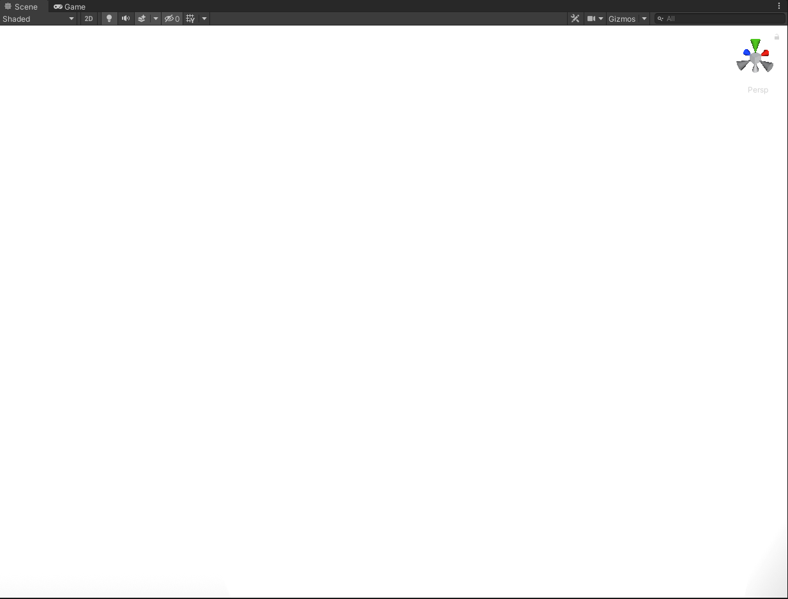
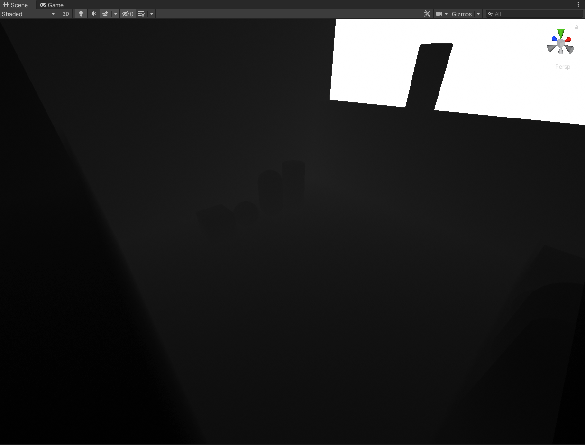
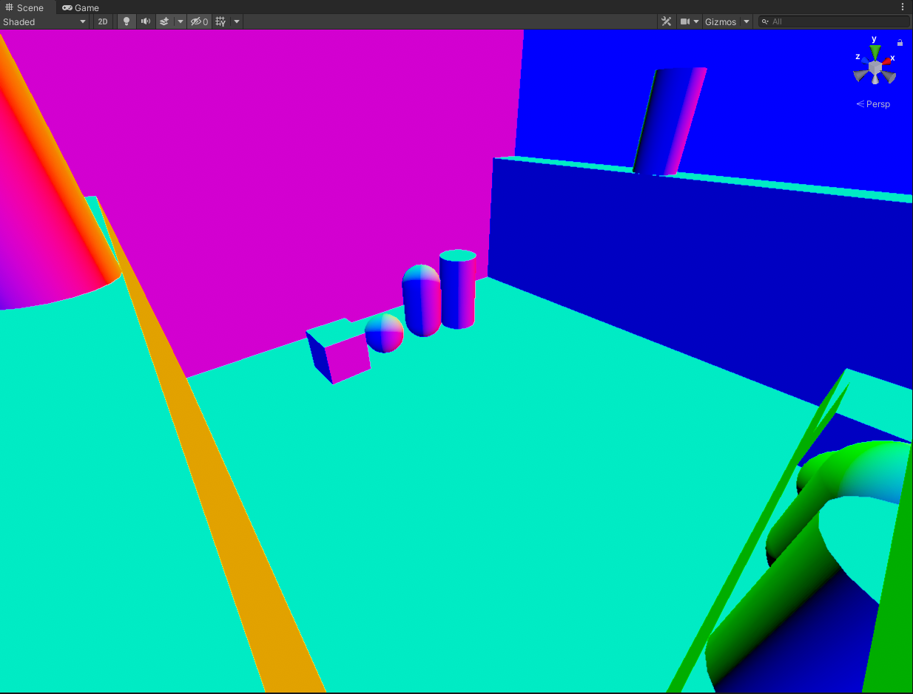
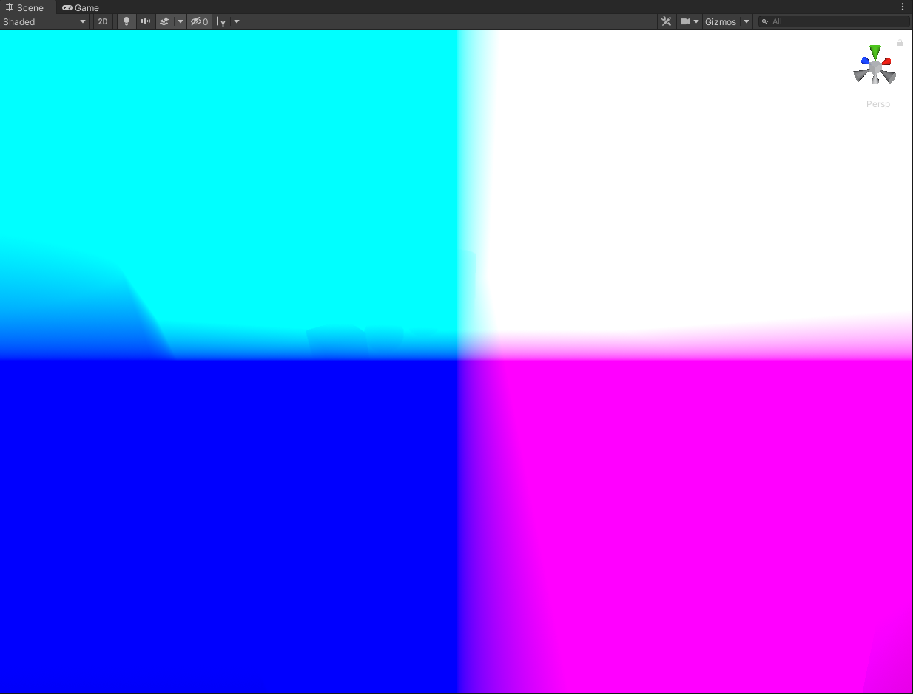
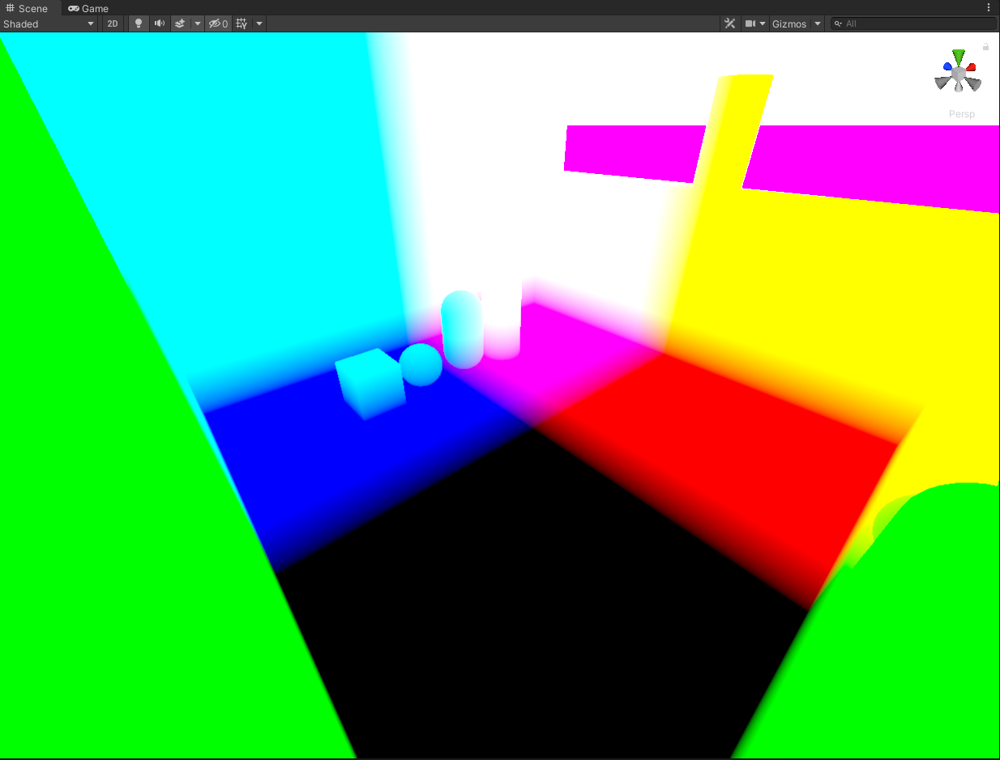

# Unity-Post-Process-Compute-VR
A ***W.I.P*** template for a compute shader based post processing effect designed for VR *(and non-vr) using the Unity Post Processing Stack.

This is a basic template effect that is a single pass, and works with the 3 built-in camera textures *(Depth, DepthNormals, MotionVector)* all calculated and sampled correctly. No other additional things are done, it's just a simple template for a compute based post process shader.

#### Original Scene: 

#### UVs (Default)

#### Raw "_CameraDepthTexture"

#### Raw "_CameraDepthNormalsTexture"

#### Raw "_CameraMotionVectorsTexture"

#### Linear Eye Depth

#### Linear 01 Depth

#### View Normals

#### World Normals

#### View Position

#### World Position
